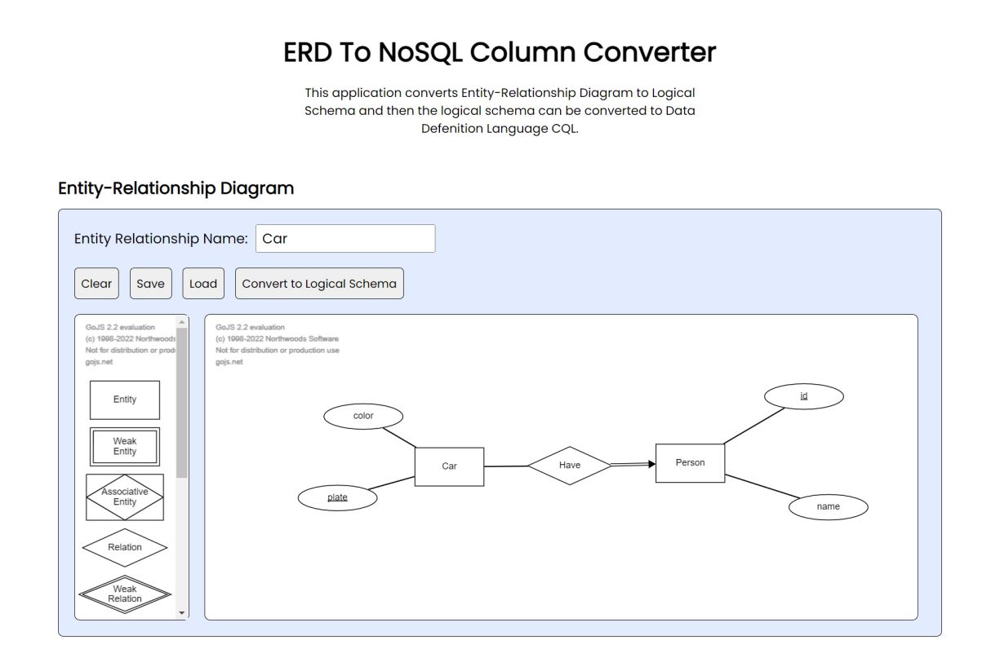
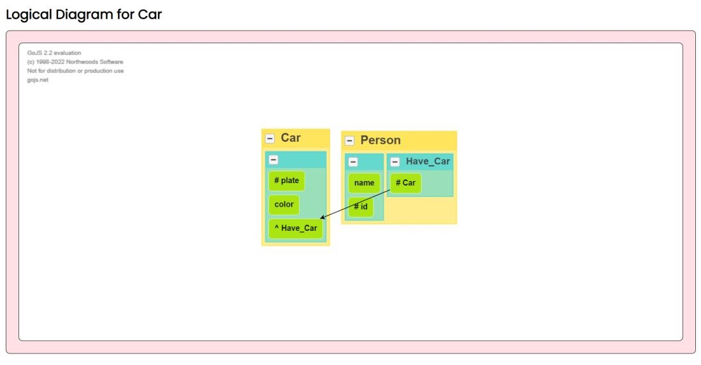

<h1 align="center">
  ERD To NoSQL Column Converter
   <h2 align="center">
      IF4092 Tugas Akhir 2
   </h2>
</h1>

<h3 align="center">
  Pengembangan Aplikasi Konversi Entity-Relationship Diagram ke 
  <br>
  Logical Schema NoSQL Berorientasi Kolom
  <br>
</h3>

<h4 align="center">
  Muhammad Fauzan Al-Ghifari
  <br>
  13518112
  <br>
  <br>
</h4>

### Description
This application converts Entity-Relationship Diagram to Logical Schema and then
the logical schema can be converted to DDL CQL.

### Spesification
Made with ___Javascript___ and ___Go.Js___

### How to Use
1. Requirement for this program is you must have a web browser
2. Open app.html
3. The app is ready to use
4. You can use the example by loading the erd from testing folder

### Application Interface
1. Entity-Relationship Diagram Creation
<div>
  
</div>
2. Logical Diagram View
<div>
  
</div>
3. Insert the Data Type
<div>
  
</div>
4. Get the DDL 
<div>
  
</div>

### Author
```
Muhammad Fauzan Al-Ghifari
13518112
```
