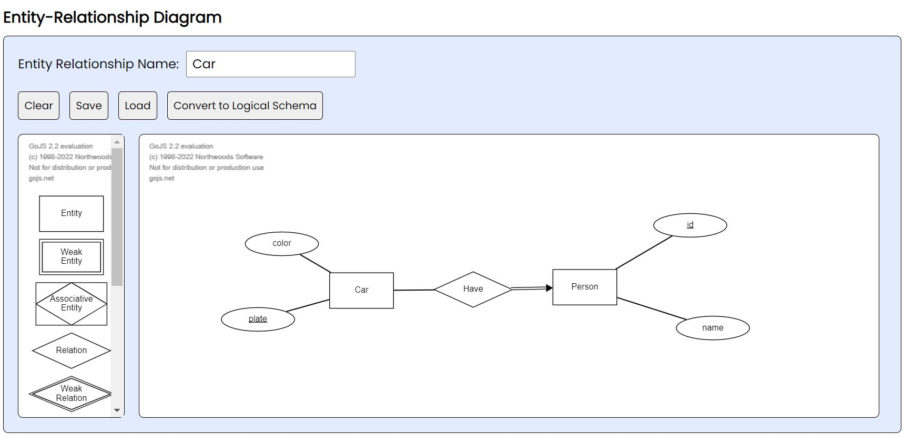
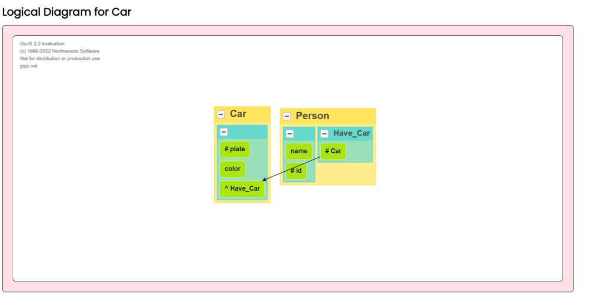
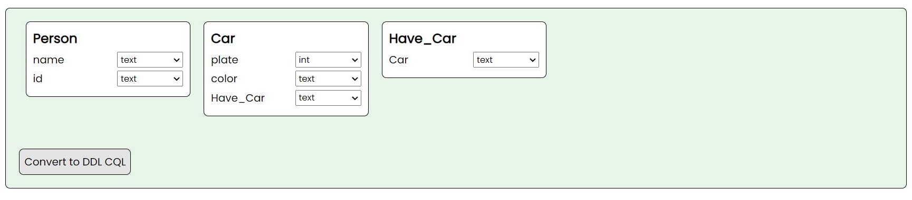
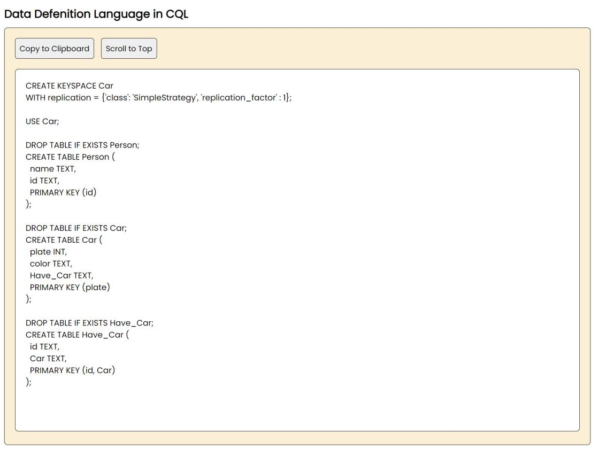

   
<h1 align="center">
  <br>
  ERD To NoSQL Column Converter
  <br>
  <br>
</h1>

<h2 align="center">
  <br>
  IF4092 Tugas Akhir 2
  <br>
</h2>

<h3 align="center">
  <br>
  Pengembangan Aplikasi Konversi Entity-Relationship Diagram ke 
  <br>
  Logical Schema NoSQL Berorientasi Kolom
  <br>
</h3>

<h2 align="center">
  <br>
  Muhammad Fauzan Al-Ghifari
  <br>
  13518112
  <br>
</h2>


&nbsp;
### Description
This application converts Entity-Relationship Diagram to Logical Schema and then
the logical schema can be converted to DDL CQL.

&nbsp;
### Spesification
Made with ___Javascript___ and ___Go.Js___


&nbsp;
### How to Use
1. Requirement for this program is you must have a web browser
2. Open app.html
3. The app is ready to use

&nbsp;
### Application Interface
1. Entity-Relationship Diagram Creation
<div>
  
</div>
2. Logical Diagram View
<div>
  
</div>
3. Insert the Data Type
<div>
  
</div>
4. Get the DDL 
<div>
  
</div>


&nbsp;
### Author
```
Muhammad Fauzan Al-Ghifari
13518112
```